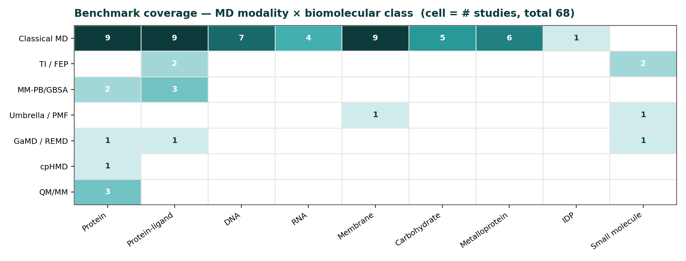
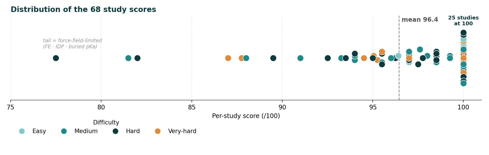

# AmberMD Agent — Benchmark

  
  
  
  

A benchmark of **68 curated literature studies** (current validated set) that measures whether the agent can **autonomously reproduce published molecular-dynamics studies** across the full biomolecular landscape — and report honestly when it can't.

  

---

## Headline

| Metric | Value |
|---|---|
| **Overall (68 studies)** | **96.4 / 100** |
| Perfect scores (100/100) | 25 / 68 |
| Difficulty range | Easy → Very-hard, all tiers 96–99 |

These 68 are the **current validated set** — studies whose prompt *and* answer key are verified correct. The remaining studies are being completed and validated, and will be added once done.

> **Model & runs:** all studies were **run and graded with [Claude Opus 4.8](https://www.anthropic.com)**. Each score is from a **single autonomous run** per study (one trajectory unless the protocol itself needs replicas / λ-windows); **run-to-run variance is not yet quantified** — bounding it is part of the in-progress human-expert evaluation.

> **Repository contents (size):** the headline numbers above are computed over all 68 studies (per-study judge results are in [`results/`](results/)). To keep the repo lightweight, only the **three example studies** featured in the [main README](../README.md#example-studies) — [`study_098`](studies/study_098/) (ubiquitin), [`study_023`](studies/study_023/) (Dickerson DNA), [`study_087`](studies/study_087/) (OmpF membrane) — ship with their **full working folders** (inputs, topologies, logs, analysis). **Trajectory files (`.nc`) are excluded everywhere** (multi-GB each). The remaining studies' working files are kept offline due to size and available on request.

---

## How the benchmark works

Three phases, kept **strictly separated** so the agent can never see what it's graded against:

1. **Curation (offline, human-verified).** Each study is distilled from a published paper into two separate files: a **prompt** (PDB ID + scientific question, phrased as a user would ask) and an **answer key** (the paper's expected outcome). Every **citation (PMID / DOI) and expected value is checked against the primary source** before a study is marked validated — the **68 here are the ones that passed** that check.
2. **Blind autonomous run.** The agent is handed **only the prompt — never the answer key**. It runs the entire pipeline unattended: research → plan → build → run → analyze → write `STUDY_REPORT.md` (detailed in [What it tests](#what-it-tests)).
3. **Independent judging.** A **separate judge agent** — not the one that ran the study — reads the **answer key *and* the source paper itself**, then scores the [5-checkpoint rubric](#scoring). The study agent and its judge never share context (see [Isolation](#isolation-anti-cheating)).

So the score reflects a curated, citation-checked target; an agent that solved it blind; and an independent grader that verified the result against the literature.

---

## What it tests

Each study is a realistic user request derived from a published paper (PDB ID + scientific question). The agent must, **fully autonomously**:

1. Retrieve protocols (PubMed) and ground every parameter in the Amber 24 manual (RAG).
2. Resolve structure / sequence / ligand data (PDB, UniProt, PubChem, ChEMBL).
3. Build the system (tLEaP, antechamber, PROPKA, metal/ligand parametrization).
4. Run the simulation on SLURM (pmemd.cuda / sander.MPI), self-correcting on failure.
5. Analyze the requested observables (cpptraj, MBAR/WHAM, MMPBSA, etc.).
6. Write a `STUDY_REPORT.md` with final numbers and a comparison to the source paper.

**Modalities covered:** classical MD · MM-PBSA / MM-GBSA (+ NMODE entropy) · alchemical TI / RBFE · umbrella-sampling PMF · GaMD · T-REMD · REST2 · constant-pH MD (+ pH-REMD) · QM/MM (sqm / DFTB3) · NEB · adaptive string method.

**Biomolecular classes covered:** protein folding/dynamics · protein–ligand · DNA (incl. modified bases, metal adducts) · RNA (incl. modified nucleotides, ribozymes, G-quadruplex) · membrane / channels · carbohydrate / glycoprotein · metalloprotein (Zn, Cu, Fe-S, heme, Compound I) · intrinsically disordered proteins · host–guest.

  

---

## Scoring

Each study is graded by an **independent LLM judge** (a separate subagent, never the one that ran the study). The judge performs a **mandatory primary-source read** (PubMed → WebSearch/WebFetch fallback) and scores five checkpoints, each a credit ∈ [0, 1]:

| Checkpoint | Weight | Grades |
|---|---:|---|
| C1 — system build | 0.20 | structure prep, force field, tLEaP cleanliness |
| C2 — methodology | 0.15 | tier-justified choices, no hardcoded defaults |
| C3 — completion | 0.15 | ran to completion, stable, no NaN |
| C4 — analysis | 0.20 | correct observables and methods |
| **C5 — literature match** | **0.30** | result agrees with the source paper |

**Per-study total** = Σ (weight × credit), with N/A checkpoints dropped and the rest renormalized to sum 1.0 (so every study stays on [0, 1]). The **overall score** is the mean of per-study totals × 100 (flat); the difficulty-weighted variant weights each study by tier (easy 1 → very-hard 4).

> Worked example — study 015 (methanol hydration TI), credits C1=1, C2=.9, C3=1, C4=.9, C5=.5:
> `0.20·1 + 0.15·.9 + 0.15·1 + 0.20·.9 + 0.30·.5 = 0.815 → 81.5 / 100`.

Source: `scripts/scoring.py` (per-study weighted sum), `scripts/weights.py` (weights), `scripts/aggregate.py` (the mean + scorecard), `scripts/schema.py` (judge-output validation).

---

## Results

  

Most studies cluster at the top (25 perfect), with a short tail of force-field-limited cases (free energies, IDP ensembles, buried pKa).

**By difficulty tier** — no systematic drop with difficulty (within small per-tier *n*; difficulty labels are author-assigned, so the tiers are non-monotonic — Medium is the lowest):

| Tier | Score | n |
|---|---:|---:|
| Easy | 98.7 | 5 |
| Medium | 96.0 | 20 |
| Hard | 96.2 | 28 |
| Very-hard | 96.7 | 15 |

**By rubric checkpoint** — build / method / completion / analysis ~99–100; the only soft spot is literature-match:

| Checkpoint | Score |
|---|---:|
| System build | 99.7 |
| Methodology | 99.1 |
| Completion | 100.0 |
| Analysis | 98.8 |
| **Literature match** | **89.6** |

**By biomolecular / method domain** (complete partition — the nine `n` sum to 68):

| Domain | Score | n | Domain | Score | n |
|---|---:|---:|---|---:|---:|
| Metalloprotein | 99.8 | 6 | Carbohydrate | 96.7 | 5 |
| RNA | 98.2 | 4 | Protein | 95.0 | 11 |
| Protein-ligand | 98.1 | 8 | Enhanced sampling / FE | 94.4 | 15 |
| Membrane | 97.9 | 9 | QM/MM | 92.8 | 3 |
| DNA | 96.9 | 7 | | | |

---

## Robustness

The headline doesn't depend on how the 68 studies are weighted or sliced — it isn't carried by an easy subset:

| View | Score |
|---|---:|
| Flat mean | 96.4 |
| Difficulty-weighted mean (easy 1 → very-hard 4) | 96.4 |
| Lowest difficulty tier (Medium, n=20) | 96.0 |
| Lowest domain (QM/MM, n=3) | 92.8 |

Difficulty-weighting **down-weights the easy tier 4×** relative to very-hard, yet the mean is **unchanged (96.4)** — so the score is *not* propped up by easy studies. No tier or domain falls below ~93; it holds across every slice. *(The defect-sensitivity analysis over the full study set will be added once the remaining studies are scored.)*

---

## Failure taxonomy

The 68's lowest scores are **not careless errors** — they cluster where the *underlying force field, sampling, or timescale* has a known ceiling, and the agent **diagnoses the limit honestly** every time. The points lost are all on **C5 (literature-match)**; build / methodology / completion / analysis stay ~99–100.

| Study | Score | Cause (self-diagnosed) |
|---|---:|---|
| 090 — Aβ-42 IDP ensemble | 77.5 | ff19SB+OPC over-stabilizes helix for IDPs; 200 ns single trajectory under-samples the disordered ensemble |
| 015 — methanol hydration ΔG (TI) | 81.5 | ΔG_hyd −3.66 vs −5.1 kcal/mol (exp) — GAFF/AM1-BCC under-polarizes the alcohol |
| 085 — Staph. nuclease buried pKa (GB pH-REMD) | 82.0 | continuum GB over-depresses the strongly-perturbed buried Asp/Glu; surface sites fine |
| 011 — thrombin RBFE (Me→Et) | 87.0 | ΔΔG +1.63 kcal/mol — correct sign, only borderline within the ±1–2 kcal/mol band |
| 006 — N-BAR membrane curvature | 87.8 | large-scale curvature remodeling needs longer / coarse-grained sampling than 50 ns all-atom |

The pattern: **build / setup / analysis are reliable; absolute free energies, IDP ensembles, and buried-residue pKa are force-field- and sampling-limited** — and the agent flags them rather than reporting confident wrong numbers. A more capable LLM would not change these; better physics (RESP/QM charges, polarizable FF, explicit-solvent CpHMD, dispersion-corrected IDP water) or longer / enhanced sampling would.

---

## Isolation (anti-cheating)

- The **orchestrator never reads the answer key** — it builds study prompts only from the prompt text (no expected outcomes in context).
- **Study agents never see** the answer key, judge rubric, or other studies — one fresh isolated subagent per study, no cross-contamination.
- **Judges are separate subagents** that read the answer key + source paper themselves; a study agent and its judge are never the same agent.
- Judges spot-checked raw data files (trajectories, `.dat`, `mdout`) to confirm results were genuinely computed, not fabricated.

---

> **Coming soon:** the remaining **32 studies** are being completed and validated — they add depth on the advanced-method modalities (TI / FEP, GaMD / REMD, umbrella, cpHMD, QM/MM). Once scored, they'll be merged in and the full-set scorecard, defect-sensitivity analysis, and coverage matrix will be updated.
