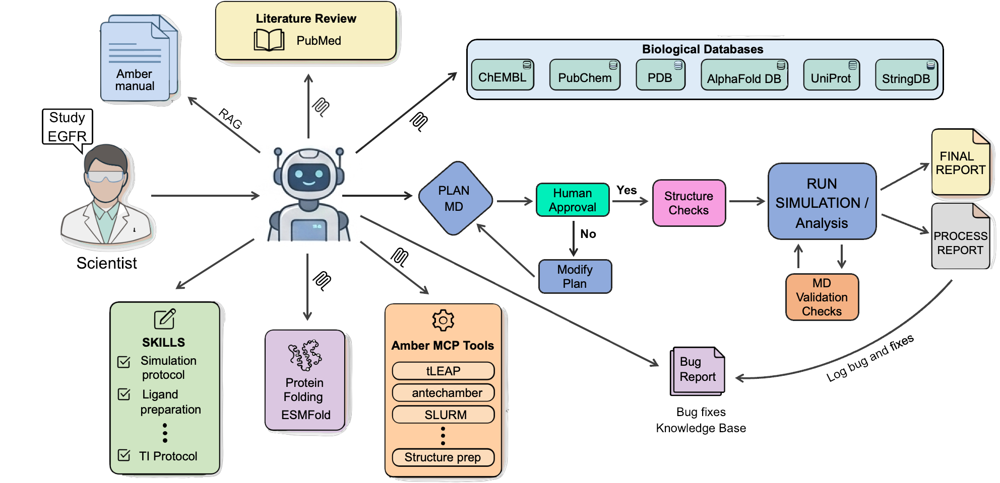
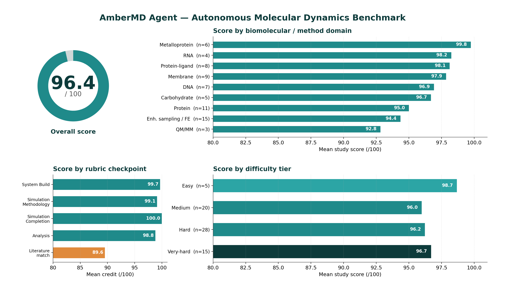

<div align="center">


**Agentic MD simulation framework — RAG-grounded planning · 8 MCP tool servers · HITL approval gate · SLURM**

[](https://python.org)
[](https://ambermd.org)
[](LICENSE)
[](https://claude.ai/code)
[](#intelligence-layer)
[](#quick-start)

*Give it a scientific question — the agent does the research for you. It retrieves
published protocols and performs a literature review from PubMed, resolves structures
and binding data from 7 live databases, justifies parameter choices with evidence —
a literature citation or the Amber 24 manual (RAG) — builds a simulation plan for
your review, runs MD on your HPC cluster via SLURM, self-corrects on failure, and
writes a scientific report.*

</div>

---

## Agent Architecture

A single **orchestrator agent** drives the whole pipeline: once you hand it a scientific question, it runs every stage itself — research → plan → build → run → monitor → analyze → report — calling the MCP tools and submitting to SLURM directly — executing only once the plan clears human approval (human-in-the-loop oversight). The agent decides each step from the manual, the literature, and what it observes — running validation checks on the fly and self-correcting when a step fails.

<p align="center">
  
</p>

<details>
<summary>Step-by-step example: binding free energy of erlotinib to EGFR</summary>

```
User: "Calculate binding free energy of erlotinib to EGFR"

Agent:
  1. PubMed   → literature review on the study (EGFR–erlotinib binding)
                 + published TI/FEP protocol / method best-practices
  2. RAG      → reads TI protocol from Amber manual
                 "thermodynamic integration setup"
                 "softcore potentials ifsc"
                 "lambda schedule recommendations"
  3. PDB      → find best EGFR+erlotinib structure, check validation report
  4. UniProt  → kinase domain boundaries, known resistance mutations
  5. PubChem  → erlotinib SMILES + 3D conformer for antechamber
  6. ChEMBL   → experimental IC50 ≈ 2 nM (validation target for ΔG)
  7. PROPKA   → assigns protonation states at pH 7.4
  8. PLAN.md  → writes simulation plan (FF, λ schedule, box, walltime)
                 ── USER APPROVES BEFORE ANY JOB RUNS ──
  9. Toolkit  → tLEaP builds system, antechamber parametrizes erlotinib
                 SLURM array submitted: 11 λ windows, 1 GPU each
 10. Monitor  → reads mdinfo after each step, validates density/energy/RMSD
 11. Analyze  → integrates dV/dλ, computes ΔG
 12. Report   → STUDY_REPORT.md: methods, ΔG result, comparison vs ChEMBL IC50 ✓

The AI is the brain. The toolkit is the hands.
The manual is the textbook. MCP servers are the library.
The plan is the gate.
```

</details>

---

## [Benchmark](Benchmark/)

A benchmark of **68 curated literature studies** (current validated set) spanning every major MD modality (classical MD, MM-PBSA/GBSA, alchemical TI/FEP, umbrella-sampling PMF, GaMD, T-REMD/REST2, constant-pH MD, QM/MM, NEB, adaptive string) across every biomolecular class (DNA, RNA, protein, protein-ligand, membrane, carbohydrate, metalloprotein, IDP). Each study is run **fully autonomously** — build → simulate → analyze → compare to the source paper — then graded by an **independent LLM judge** — a separate agent that performs a *mandatory primary-source read* — on a weighted 5-checkpoint rubric. Study agents never see the answer key; the judge reads it and the paper itself (anti-cheating isolation by design).

These 68 are the studies whose prompt **and** answer key are verified correct; the broader study set is being curated and validated. **All studies were run end-to-end on Claude Opus 4.8.** Full report — methodology, scoring formula, robustness/sensitivity analysis, failure taxonomy, and the answer-key integrity audit — in **[`Benchmark/README.md`](Benchmark/README.md)**.

<p align="center">
  
</p>

| | |
|---|---|
| **Overall** | **96.4 / 100** (68 studies) |
| **By difficulty** | Easy 98.7 · Medium 96.0 · Hard 96.2 · **Very-hard 96.7** — no drop with difficulty (all 68 studies split across the four tiers) |
| **By domain** | 92–100 across all 9 biomolecular/method classes |
| **By checkpoint** | Build 99.7 · Methodology 99.1 · Completion 100.0 · Analysis 98.8 · **Literature-match 89.6** |
| **Perfect scores** | 25 / 68 studies at 100 |

The one soft spot — **literature-match 89.6** — concentrates in force-field-limited *absolute* quantities (free energies, IDP ensembles, buried-residue pKa); there the agent **flags the force-field limit** rather than reporting a confident wrong number. Build / methodology / completion / analysis all sit at ~99–100.

> **Note:** scores above are from the automated LLM-judge pipeline. A detailed **human (expert) evaluation of every study's full report is currently in progress** and will be used to validate and refine these numbers.

### Reproducibility & limitations

- **Autonomy.** Benchmark studies ran **fully unattended** — the plan-approval gate was **auto-approved by the harness** (no human reviewed the plans), so each study drove itself build → run → analyze → report with **zero human intervention**. The *ran-to-completion* checkpoint scored **100/100 across all 68**, i.e. the loop reached a finished, reported result every time. *(In normal interactive use the same gate is a human checkpoint — see [Agent Architecture](#agent-architecture).)*
- **Single run per study.** Each score is from **one agent run** (one trajectory per system unless the protocol itself needs replicas/λ-windows). Run-to-run variance is **not yet quantified** — bounding it is part of the in-progress human-expert evaluation.
- **Sampling.** Most studies are **single short-to-moderate trajectories (50–200 ns)**. Absolute free energies, IDP ensembles, and buried-residue pKa are force-field- and sampling-limited (see the [failure taxonomy](Benchmark/README.md#failure-taxonomy)); the agent **flags** these rather than overclaiming.
- **Compute.** Runs require a **CUDA-GPU SLURM cluster**; per-study cost scales with system size and simulation length. Agent-reasoning tokens are modest next to the GPU time.

---

## Example Studies

Real simulations run end-to-end by this agent, drawn from the [benchmark](Benchmark/) and spanning biomolecular classes. Every number below is traceable to that study's final report:

---

**[BPTI (5PTI) — Native-Fold Stability](Benchmark/studies/study_071/)**  · *protein · 100.0 / 100*

> *"Run a 100 ns MD simulation of BPTI (5PTI) in explicit water at 300 K. Check structural stability via backbone RMSD and compare to the crystal structure."*

The classic protein-MD benchmark, and the simplest study to read. Agent stripped the deuterium from the 1.0 Å joint X-ray/neutron 5PTI structure, rebuilt protons, ran 100 ns in OPC water, and measured backbone RMSD against the crystal structure. Backbone RMSD held at **1.06 Å** (0.97 Å over the last 50 ns), with radius of gyration steady at 11.1 Å — the native fold fully maintained, consistent with the Shaw 2010 long-timescale picture. Perfect score.

- 📄 **[Read the final simulation report →](Benchmark/studies/study_071/STUDY_REPORT.md)**
- 📋 **[Agent log file →](Benchmark/studies/study_071/PROCESS_REPORT.md)** — track the agent's step-by-step behavior

---

**[Ubiquitin (1UBQ) — Conformational Ensemble vs NMR](Benchmark/studies/study_098/)**  · *protein · 97.0 / 100*

> *"Simulate ubiquitin (1UBQ) for 100 ns and compare the conformational ensemble to NMR data. Focus on the C-terminal tail flexibility and β1–β2 loop dynamics."*

Agent ran 100 ns and computed Lipari–Szabo S² order parameters (iRED, 72 N–H vectors) plus per-residue RMSF. Rigid core (CA RMSD 0.89 Å) with a C-terminal tail rising monotonically to 6.9 Å RMSF as S² collapses 0.78 → 0.02 — reproducing the Lange 2008 mobile-tail / stable-core picture, and correctly noting that 100 ns cannot reach the µs pincer mode.

- 📄 **[Read the final simulation report →](Benchmark/studies/study_098/STUDY_REPORT.md)**
- 📋 **[Agent log file →](Benchmark/studies/study_098/PROCESS_REPORT.md)** — track the agent's step-by-step behavior

---

**[Dickerson Dodecamer — B-DNA Helical Analysis](Benchmark/studies/study_023/)**  · *DNA · 96.4 / 100*

> *"Simulate the Dickerson dodecamer (1BNA) — a classic B-DNA duplex. Run 50 ns with OL21 force field and analyze helical parameters (rise, twist, roll). Compare to crystallographic values."*

Agent built d(CGCGAATTCGCG)₂ with the OL21 DNA force field, ran 50 ns, and ran cpptraj `nastruct` over 5,000 frames for per-step rise / twist / roll and groove widths. Rise 3.29 Å, mean twist 34.9°, B-form maintained, core RMSD 1.47 Å — matching Drew 1981, with the mild twist under-estimate flagged as a known AMBER-FF feature.

- 📄 **[Read the final simulation report →](Benchmark/studies/study_023/STUDY_REPORT.md)**
- 📋 **[Agent log file →](Benchmark/studies/study_023/PROCESS_REPORT.md)** — track the agent's step-by-step behavior

---

**[OmpF Porin — Pore & L3 Loop Dynamics in an *E. coli* Bilayer](Benchmark/studies/study_087/)**  · *lipid bilayer · 97.5 / 100*

> *"Set up OmpF porin (2OMF) — a trimeric outer membrane protein from E. coli — in a POPE/POPG bilayer (mimicking E. coli outer membrane). Simulate 50 ns. Analyze the pore dimensions and loop L3 dynamics."*

Agent built the OmpF trimer in a mixed POPE/POPG bilayer, ran 50 ns, aligned to the β-barrel backbone, then measured L3-loop RMSD/RMSF, cross-channel eyelet distances on the constriction residues (acidic D113/E117 vs the basic R42/R82/R132 ladder), and L3-zone pore proxies. Stable trimer (barrel RMSD 1.11 Å), rigid L3 constriction (RMSF 0.50 Å vs 0.74 Å barrel), eyelet acidic-to-basic spacing ~8.7–13 Å — recovering the Cowan 1992 16-stranded β-barrel architecture with L3 folded into the pore to form the constriction zone.

- 📄 **[Read the final simulation report →](Benchmark/studies/study_087/STUDY_REPORT.md)**
- 📋 **[Agent log file →](Benchmark/studies/study_087/PROCESS_REPORT.md)** — track the agent's step-by-step behavior

---

## Requirements

| Need | Detail |
|------|--------|
| **HPC cluster** | SLURM scheduler + ≥1 CUDA GPU — all MD runs through `pmemd.cuda`; nothing Amber-heavy touches the login node |
| **Amber / AmberTools** | `pmemd.cuda` · `sander` · `tleap` · `antechamber` · `cpptraj` on the compute nodes — other versions work, but **all benchmark studies were run on Amber 24** (`module load amber/24`) |
| **Claude Code** | the agent runtime (CLI / desktop / IDE) — loads `.mcp.json`, the skills, and the MCP servers |

---

## Quick Start

**1. Clone**
```bash
git clone https://github.com/nagarh/amber-md-agent
cd amber-md-agent
```

**2. Install Python deps** — one command via the bundled `environment.yml`:
```bash
conda env create -f environment.yml      # creates env "amber_development"
conda activate amber_development
```
<details>
<summary>Or install manually</summary>

```bash
conda create -n amber_development python=3.11 -y
conda install -n amber_development -c conda-forge \
    numpy scipy matplotlib rdkit parmed mdanalysis propka biopython pdfminer.six -y
conda run -n amber_development pip install fastmcp
```
</details>

Use the resulting interpreter path everywhere (e.g. `~/.conda/envs/amber_development/bin/python`). This is the Python toolkit only — **Amber/AmberTools is a separate cluster install** (see Requirements).

**3. Register the 8 MCP servers** — edit `.mcp.json` (Claude Code reads this at startup).

The shipped `.mcp.json` has absolute paths to the author's environment. Each server needs three fields pointed at YOUR setup: `command` (your Python), `cwd` (your clone), and `args` (the server script, kept repo-relative). Every server script lives in `mcp_servers/`, so this rebases all 8 at once:

```bash
PY=$(which python)     # e.g. /home/<you>/.conda/envs/amber_development/bin/python
REPO=$(pwd)            # the cloned repo directory
python - <<EOF
import json, os
cfg = json.load(open('.mcp.json'))
for srv in cfg['mcpServers'].values():
    srv['command'] = '${PY}'
    srv['cwd']     = '${REPO}'
    srv['args']    = ['mcp_servers/' + os.path.basename(a) for a in srv['args']]
json.dump(cfg, open('.mcp.json','w'), indent=2)
print('updated', len(cfg['mcpServers']), 'servers ->', '${REPO}')
EOF
```

Or manually edit each entry's `command` (Python path), `args` (relative path
from `cwd`), and `cwd` (clone location). Example for one entry:
```json
"amber": {
  "command": "/path/to/your/python",
  "args": ["mcp_servers/amber_mcp_server.py"],
  "cwd": "/path/to/cloned/amber-md-agent"
}
```
All 8 servers (`amber`, `pdb`, `uniprot`, `pubchem`, `chembl`, `alphafold`, `stringdb`, `pubmed`) follow the same pattern.

**4. Configure your cluster** — edit `scripts/slurm_template.sh` once (the file is self-documenting; change the marked SBATCH directives **and** the Amber environment block — these ship with the author's values):
```bash
#SBATCH --partition=gpu          # your partition
#SBATCH --gres=gpu:a100:1        # your GPU type / count
#SBATCH --time=48:00:00          # your walltime cap
# (add --account / --qos / --constraint if your site requires them)

module load amber/24             # your Amber module(s)
source /path/to/amber/amber.sh   # your Amber install — REQUIRED, else pmemd not found
```
`md_agent.py` copies these lines verbatim into every generated job script, so you edit them here once — never in generated scripts.

**5. Verify**
```bash
python scripts/md_agent.py check-env       # tools + RAG index check
claude mcp list                             # confirms all 8 servers register
```

**6. Start**
```bash
claude        # opens Claude Code — MCP servers auto-connect via .mcp.json
```

> The Amber manual RAG index (`references/amber_index.json`) is pre-built and included. No manual setup required.
>
> If `claude mcp list` shows red/missing servers, check that `command` resolves
> to a Python with FastMCP + required deps installed, and that `cwd` exists.

---

## Repository Layout

Top-level layout of the amber-md-agent project:

```
amber-md-agent/
├── skills/              ← project skills (this agent)
├── scripts/
│   ├── md_agent.py          ← toolkit: all Amber ops, RAG, SLURM (wrapped by amber MCP)
│   ├── cap_protein.py       ← ACE/NME terminal capping (wrapped as mcp__amber__cap_protein)
│   ├── loop_model.py        ← AlphaFold/ESMFold loop modeling (wrapped as mcp__amber__loop_model)
│   └── slurm_template.sh    ← cluster config — edit once for your cluster
├── mcp_servers/
│   ├── amber_mcp_server.py  ← FastMCP server wrapping scripts/md_agent.py
│   ├── pdb_server.py        ← RCSB PDB search + structure info
│   ├── pubchem_server.py    ← compound search + 3D conformers
│   ├── uniprot_server.py    ← protein info, domains, variants
│   ├── alphafold_server.py  ← AlphaFold structure + pLDDT
│   ├── chembl_server.py     ← bioactivity, ADMET, drug targets
│   ├── stringdb_server.py   ← protein interaction networks
│   └── pubmed_server.py     ← literature search
├── CLAUDE.md
└── studies/
    └── <study_name>/
        ├── raw_pdbs/
        ├── system/      ← tleap.in, prmtop, inpcrd, clean.pdb
        ├── simulations/ ← min1/, min2/, heat/, equil/, prod/
        │                   TI: lambda_0.0/ | Umbrella: windows/w00/
        ├── analysis/    ← cpptraj scripts, .dat files, plots/
        ├── logs/        ← SLURM .out/.err, pipeline logs
        ├── PLAN.md            ← decisions + defaults, USER APPROVAL GATE (Step 4)
        ├── PROCESS_REPORT.md  ← live process log (init Step 5, finalize Step 7)
        └── STUDY_REPORT.md    ← scientific findings (written at Step 7)
```

**Study organization rules:**
- New study → `studies/<name>/`. All fetched PDBs → `raw_pdbs/`. Never place study files at root.
- `PLAN.md`: written at end of Step 4 (workflow), BEFORE any sbatch. Lists FF, protonation, box, sim times, walltime, analysis, caveats — with all defaults marked. User must type `approve` (or override X: Y) before Step 5 begins. Last line `## Approval:` is the gate.
- `PROCESS_REPORT.md`: created at simulation start, updated after every validation gate, finalized after production. Engineering log — steps, SLURM job IDs, validation pass/fail, file manifest.
- `STUDY_REPORT.md`: written once after analysis complete. Scientific report — objective, methods, RMSD/RMSF/ΔG results, key findings.

---

## Intelligence Layer

### Agent Skills

**24 domain skills**, loaded on demand — no prompting needed. Six core skills auto-load on every run; the rest load when their modality is triggered, so the context stays lean until a method is actually needed.

**Core — always on:**

| Skill | Auto-loads when... |
|-------|-------------------|
| `amber-workflow.md` | Any simulation or analysis request |
| `amber-protein-prep.md` | Protein structure prep, terminal capping, tLEaP |
| `amber-ligand.md` | Ligand parametrization via antechamber/GAFF2 |
| `amber-validate.md` | After any tool run, before proceeding |
| `amber-bugs.md` | Error encountered · TI instability · ParmEd · MMPBSA |
| `amber-mcp.md` | Fetching structures or validating ΔG against experiment |

**Modality — load on trigger:**

| Group | Skills |
|-------|--------|
| Free-energy | `amber-ti` (TI/FEP) · `amber-mmpbsa` (MM-PB/GBSA + NMODE) · `amber-rism` (3D-RISM) |
| Enhanced sampling | `amber-gamd` (GaMD/LiGaMD/Pep-GaMD) · `amber-rest2` (REST2/T-REMD) · `amber-sgld` (SGLD) · `amber-abmd` (ABMD/WT-ABMD) · `amber-asm` (adaptive string) |
| Biased / path | `amber-umbrella` (US + WHAM/MBAR) · `amber-smd` (steered MD + Jarzynski) · `amber-neb` (NEB MEP) |
| System class | `amber-nucleic_acid` (DNA/RNA) · `amber-carbohydrate` (glycan) · `amber-membrane` (LIPID21) · `amber-metal_complex` (ZAFF / 12-6-4) · `amber-small_molecule` (GAFF2) |
| Special methods | `amber-qm_mm` (sqm PM6/PM7, DFTB3) · `amber-cphmd` (constant-pH / pH-REMD) |

Every skill is **pure operational instruction** — no hardcoded parameter defaults; each force-field / water / ion choice is re-justified per study via the tier protocol (lit precedent → manual → training, always manual-validated). See [`CLAUDE.md`](CLAUDE.md) §Core Rule: No Hardcoded Defaults.

### MCP Database Servers

Structured tool-use via MCP protocol — the agent resolves structures, SMILES, and experimental data at query time, not from cache:

| Server | Backend | Provides |
|--------|---------|----------|
| `amber` | FastMCP wrapper over `md_agent.py` | Every Amber operation as MCP tool: tLEaP, antechamber, cpptraj, pmemd submit, RAG manual queries, SLURM orchestration, validation gates |
| `pdb` | RCSB Protein Data Bank | Structure search, quality validation reports, ligand info |
| `uniprot` | UniProt/Swiss-Prot | Domain boundaries, disease mutations, PTMs, disulfides, residue → PDB mapping |
| `pubchem` | NCBI PubChem | Compound SMILES, 3D conformers for antechamber parametrization |
| `chembl` | EMBL-EBI ChEMBL | Experimental Ki/IC50/EC50, ADMET, mechanism — ΔG validation target |
| `alphafold` | AlphaFold DB | Predicted structures + per-residue pLDDT when no crystal exists |
| `stringdb` | STRING | PPI networks, pathway enrichment, off-target context |
| `pubmed` | NCBI PubMed via Europe PMC | Published protocols, simulation methods, full-text Methods sections (Tier 1 source for dynamic force field selection — see [skills/amber-workflow.md](skills/amber-workflow.md) §Force fields) |

---

## Coming Soon — Tree RAG (reasoning-based retrieval)

Current RAG in the agent (`scripts/rag_amber.py`) is a **flat, lexical TF-IDF** index over all 1,034 manual pages. It is fast, free, and precise *when the query uses the manual's exact jargon* — but it has a **vocabulary gap**: paraphrase a question ("how do I freeze bond lengths?" instead of "SHAKE") and lexical matching collapses.

**[Tree RAG](Tree_RAG/)** (in `Tree_RAG/`, prototype built) replaces lexical lookup with **reasoning-based tree traversal** — a re-implementation of [VectifyAI PageIndex](https://github.com/VectifyAI/PageIndex). The manual is parsed into a hierarchical tree (Part → Chapter → Section → sub-section: **541 nodes, 486 leaves, median leaf 1 page**), and the agent **walks the tree by reasoning over node titles/summaries** — root → Part → Chapter → leaf — in 3–4 hops. **No embeddings, no vector DB, no TF-IDF.** The reasoning LLM *is the agent itself*, so retrieval inherits the agent's domain understanding instead of bag-of-words overlap — making it robust to vocabulary where lexical matching scores zero.

The tree (1,034 manual pages → 541 nodes), traced as the agent retrieves for the query *"How do I set up constant-pH MD?"*:

```
Amber Reference Manual  ·  root
│
├─ I.   Introduction & Installation ······ 2 ch
├─ II.  Amber force fields ················ 9 ch
├─ III. System preparation ··············· 9 ch
├─ IV.  Running simulations ·············· 14 ch        ◄─ ① pick Part
│        ├─ 21. sander
│        ├─ 24. Sampling configuration space
│        ├─ 26. Constant pH calculations               ◄─ ② pick Chapter
│        │     ├─ 26.1 Background
│        │     ├─ 26.2 Preparing a system for constant pH
│        │     ├─ 26.3 Running at constant pH           ◄─ ③ leaf → read pg 583–585
│        │     ├─ 26.6 pH Replica Exchange MD
│        │     └─ 26.7 cphstats
│        └─ …
└─ V.   Analysis of simulations ·········· 10 ch

   levels:  root → 5 Parts → 44 Chapters → 225 Sections → 266 sub-sections
   walk:    reason over titles/summaries, pick ONE branch per level,
            3–4 hops, no embeddings → land on a ~1-page leaf
```

---

## What Can It Run?

Any protocol in the Amber manual — the agent searches PubMed for published methods on your target, queries the Amber manual via RAG, and builds the workflow from scratch. Not a fixed menu.

**Methods** — classical MD · TI / FEP / RBFE · MM-PBSA / MM-GBSA (+ NMODE entropy) · umbrella sampling + WHAM/MBAR · steered MD + Jarzynski · GaMD / LiGaMD / Pep-GaMD · T-REMD · REST2 · constant-pH MD (+ pH-REMD) · QM/MM (sqm, DFTB3) · NEB · adaptive string · 3D-RISM · SGLD.

**System classes** — protein folding/dynamics · protein–ligand · DNA · RNA · membrane / channels · carbohydrate / glycoprotein · metalloprotein (Zn, Cu, Fe-S, heme) · intrinsically disordered proteins · host–guest.

Every item above is **demonstrated end-to-end in the [benchmark](#benchmark)** — not an aspirational list.

---

<details>
<summary>🔧 CLI Reference</summary>

```bash
# Environment
python scripts/md_agent.py check-env

# PDB operations
python scripts/md_agent.py fetch 1UBQ
python scripts/md_agent.py inspect 1UBQ.pdb
python scripts/md_agent.py clean 1UBQ.pdb --output clean.pdb
python scripts/md_agent.py preflight clean.pdb

# Amber manual search (RAG)
python scripts/md_agent.py rag-query "thermodynamic integration setup"
python scripts/md_agent.py rag-section "Umbrella Sampling"
python scripts/md_agent.py rag-pages 256 262

# Write input files
python scripts/md_agent.py write-mdin min.mdin --params '{"imin":1,"maxcyc":10000,"ntb":1,"cut":10.0}'
python scripts/md_agent.py write-tleap build.in --commands "source leaprc.protein.ff19SB; ..."
python scripts/md_agent.py write-cpptraj analysis.in --commands "..."

# SLURM
python scripts/md_agent.py write-slurm run.sh --commands "pmemd.cuda ..." --job-name prod_run --gpus 1
python scripts/md_agent.py write-slurm-array array.sh --command-template "..." --array-range "0-10"
python scripts/md_agent.py sbatch run.sh
python scripts/md_agent.py squeue
python scripts/md_agent.py sacct

# Diagnostics
python scripts/md_agent.py energy prod.mdout
python scripts/md_agent.py convergence rmsd.dat
python scripts/md_agent.py validate-step prod.mdout --expected-nstep 50000 --check-rst7 prod.rst7
```

</details>

---

*RAG-grounded so every decision traces to the manual, not training data. HITL-gated so science stays in the loop. Literature-validated so results mean something.*

---

## Citation

If you use AmberMD Agent, please cite:

```bibtex
@software{nagar_ambermd_agent_2026,
  author = {Nagar, Hemant},
  title  = {AmberMD Agent: an agentic framework for autonomous molecular-dynamics simulation},
  year   = {2026},
  url    = {https://github.com/nagarh/amber-md-agent}
}
```

---

**Author:** Hemant Nagar · Ohio University — [hn533621@ohio.edu](mailto:hn533621@ohio.edu)
