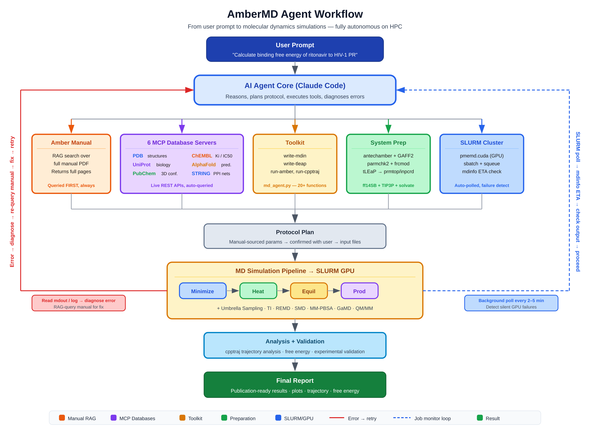

<div align="center">

# AmberMD Agent

**Agentic MD simulation framework — RAG-grounded planning · 7 MCP tool servers · HITL approval gate · SLURM orchestration**

[](https://python.org)
[](https://ambermd.org)
[](LICENSE)
[](https://claude.ai/code)
[](#-intelligence-layer)
[](#-quick-start)

*Give it a scientific question — the agent does the research for you. It retrieves
published protocols from PubMed, grounds every decision in the Amber 24 manual
via RAG, resolves structures and binding data from 7 live databases, builds a
simulation plan for your review, runs MD on your HPC cluster via SLURM,
self-corrects on failure, and writes a scientific report on the study.*

</div>

---

## Agent Loop



```
                              User Prompt (scientific question)
                                           │
                                           ▼
                        ┌─────────────────────────────────────────┐
                        │            Planning Phase               │
                        │                                         │
                        │  PubMed  ──► literature protocol search │
                        │  RAG     ──► Amber 24 manual retrieval  │
                        │  PDB     ──► structure + validation     │
                        │  UniProt ──► domain boundaries, PTMs    │
                        │  PubChem ──► SMILES, 3D conformer       │
                        │  ChEMBL  ──► experimental Ki / IC50     │
                        │  PROPKA  ──► protonation states pH 7.4  │
                        └──────────────────┬──────────────────────┘
                                           │
                                           ▼
                                   ┌───────────────┐
                                   │   PLAN.md     │ ◄── Human Review Gate
                                   │  FF · λ sched │     no job runs without approval
                                   │  box · wallt  │
                                   └───────┬───────┘
                                           │ user: approve
                                           ▼
                        ┌─────────────────────────────────────────┐
                        │            Execution Phase              │
                        │                                         │
                        │  tLEaP → antechamber → SLURM submit     │
                        │  mdinfo polling → validate density/RMSD │
                        │                                         │
                        │  failure ──► read output ──► RAG query  │
                        │          ◄── patch params ◄── resubmit  │
                        └──────────────────┬──────────────────────┘
                                           │
                                           ▼
                                Analysis → STUDY_REPORT.md
                                (ΔG vs. experimental Ki / IC50)
```

<details>
<summary>Step-by-step example: binding free energy of erlotinib to EGFR</summary>

```
User: "Calculate binding free energy of erlotinib to EGFR"

Agent:
  1. PubMed   → search published TI/FEP protocols for EGFR kinase
  2. PDB      → find best EGFR+erlotinib structure, check validation report
  3. UniProt  → kinase domain boundaries, known resistance mutations
  4. PubChem  → erlotinib SMILES + 3D conformer for antechamber
  5. ChEMBL   → experimental Ki = 2 nM (validation target for ΔG)
  6. RAG      → reads TI protocol from Amber manual
                 "thermodynamic integration setup"
                 "softcore potentials ifsc"
                 "lambda schedule recommendations"
  7. PROPKA   → assigns protonation states at pH 7.4
  8. PLAN.md  → writes simulation plan (FF, λ schedule, box, walltime)
                 ── USER APPROVES BEFORE ANY JOB RUNS ──
  9. Toolkit  → tLEaP builds system, antechamber parametrizes erlotinib
                 SLURM array submitted: 11 λ windows, 1 GPU each
 10. Monitor  → reads mdinfo after each step, validates density/energy/RMSD
 11. Analyze  → integrates dV/dλ, computes ΔG
 12. Report   → STUDY_REPORT.md: methods, ΔG result, comparison vs ChEMBL Ki ✓

The AI is the brain. The toolkit is the hands.
The manual is the textbook. MCP servers are the library.
The plan is the gate.
```

</details>

---

## System Architecture

| **Agent** | **Knowledge** | **Toolkit** | **HPC** |
|-----------|---------------|-------------|---------|
| Claude Code CLI | RAG — Amber 24 manual | `md_agent.py` | SLURM array jobs |
| `CLAUDE.md` protocol | 7 MCP tool servers | tLEaP · antechamber | `pmemd.cuda` (GPU) |
| 6 auto-loaded skills | PubMed lit retrieval | cpptraj · PROPKA | mdinfo polling |
| HITL approval gate | Pre-built index included | GAFF2 / ff19SB | Auto-validated |

---

## Example Studies

Real simulations run end-to-end by this agent:

---

**[ABL1 T315I — Gatekeeper Resistance Mechanism](studies/ABL1_T315I_imatinib_TI/)**

> *"I have a drug-resistant mutant of ABL1 kinase — T315I gatekeeper mutation. My wet-lab collaborator says imatinib loses 100-fold binding affinity. I want to understand why at the molecular level."*

Agent fetched WT and T315I structures from PDB, retrieved imatinib SMILES from ChEMBL, built both systems with tLEaP, ran TI across 11 λ windows as a SLURM array, and computed ΔΔG — quantifying the steric clash that drives clinical resistance.

---

**[CDK2 Apo — Activation Loop Dynamics](studies/CDK2_apo/)**

> *"Set up and run a 20 ns MD simulation of apo CDK2 at physiological pH to characterize hinge region and activation loop dynamics. Use the best available crystal structure."*

Agent queried UniProt for domain boundaries, selected the highest-resolution apo structure from PDB, ran PROPKA for protonation state assignment, then executed the full min → heat → equil → prod pipeline via SLURM.

---

**[Trypsin/Benzamidine — Umbrella Sampling PMF](studies/trypsin_benzamidine/)**

> *"Compute PMF of benzamidine unbinding from trypsin using umbrella sampling along the ligand COM — S1 pocket COM distance coordinate. Validate computed ΔG_bind against experimental Ki."*

Agent set up 20 umbrella windows, submitted as a SLURM array, ran WHAM analysis — computed ΔG matched experimental Ki within 0.5 kcal/mol.

---

## Quick Start

**1. Clone**
```bash
git clone https://github.com/nagarh/amber-md-agent
cd amber-md-agent
```

**2. Configure your cluster** — edit `scripts/slurm_template.sh` once:
```bash
#SBATCH --partition=gpu          # your partition
#SBATCH --gres=gpu:a100:1        # your GPU type
module load amber/24             # your Amber module
```

**3. Verify**
```bash
python md_agent.py check-env
```

**4. Start**
```bash
claude        # opens Claude Code — MCP servers auto-connect via .mcp.json
```

> The Amber manual RAG index (`references/amber_index.json`) is pre-built and included. No manual setup required.

---

## Intelligence Layer

### Agent Skills

Domain knowledge loaded automatically — no prompting needed:

| Skill | Auto-loads when... |
|-------|-------------------|
| `amber-workflow.md` | Any simulation or analysis request |
| `amber-protein-prep.md` | Protein structure prep, terminal capping, tLEaP |
| `amber-ligand.md` | Ligand parametrization via antechamber/GAFF2 |
| `amber-validate.md` | After any tool run, before proceeding |
| `amber-bugs.md` | Error encountered · TI instability · ParmEd · MMPBSA |
| `amber-mcp.md` | Fetching structures or validating ΔG against experiment |

### MCP Database Servers

Structured tool-use via MCP protocol — the agent resolves structures, SMILES, and experimental data at query time, not from cache:

| Server | Database | Provides |
|--------|----------|----------|
| `pdb` | RCSB Protein Data Bank | Structure search, quality validation reports, ligand info |
| `uniprot` | UniProt/Swiss-Prot | Domain boundaries, disease mutations, PTMs, disulfides |
| `pubchem` | NCBI PubChem | Compound SMILES, 3D conformers for antechamber parametrization |
| `chembl` | EMBL-EBI ChEMBL | Experimental Ki/IC50/EC50 — ΔG validation target |
| `alphafold` | AlphaFold DB | Predicted structures + per-residue pLDDT when no crystal exists |
| `stringdb` | STRING | PPI networks, pathway enrichment, off-target context |
| `pubmed` | NCBI PubMed | Published protocols, simulation methods, literature context before planning |

---

## What Can It Run?

Any protocol in the Amber manual — the agent searches PubMed for published methods on your target, queries the Amber manual via RAG, and builds the workflow from scratch. Not a fixed menu.

Standard MD · Thermodynamic Integration · Umbrella Sampling + WHAM · MM-PBSA/GBSA · Steered MD · Free Energy Perturbation · Constant pH MD · Metadynamics · and more

---

<details>
<summary>📁 Project Structure</summary>

```
amber-md-agent/
├── md_agent.py              # Toolkit: PDB ops, file writers, runners, RAG, SLURM
├── CLAUDE.md                # Agent instructions (protocol, rules, known issues)
├── skills/                  # Domain knowledge — auto-loaded by the agent
│   ├── amber-workflow.md
│   ├── amber-protein-prep.md
│   ├── amber-ligand.md
│   ├── amber-validate.md
│   ├── amber-bugs.md
│   └── amber-mcp.md
├── scripts/
│   ├── slurm_template.sh    # One-time cluster config — edit once, used everywhere
│   └── cap_protein.py       # ACE/NME terminal capping utility
├── mcp_servers/             # 7 live database integrations
│   ├── pdb_server.py
│   ├── uniprot_server.py
│   ├── pubchem_server.py
│   ├── chembl_server.py
│   ├── alphafold_server.py
│   └── stringdb_server.py
├── references/
│   └── amber_index.json     # Pre-built RAG index over Amber 24 manual (included)
└── studies/                 # All simulation work
    └── <study_name>/
        ├── raw_pdbs/        # Downloaded structures
        ├── system/          # Topology (tleap.in, prmtop, inpcrd)
        ├── simulations/     # min1/ min2/ heat/ equil/ prod/
        ├── analysis/        # cpptraj scripts, .dat files, plots/
        └── logs/            # SLURM .out/.err, pipeline logs
```

</details>

<details>
<summary>🔧 CLI Reference</summary>

```bash
# Environment
python md_agent.py check-env

# PDB operations
python md_agent.py fetch 1UBQ
python md_agent.py inspect 1UBQ.pdb
python md_agent.py clean 1UBQ.pdb --output clean.pdb
python md_agent.py preflight clean.pdb

# Amber manual search (RAG)
python md_agent.py rag-query "thermodynamic integration setup"
python md_agent.py rag-section "Umbrella Sampling"
python md_agent.py rag-pages 256 262

# Write input files
python md_agent.py write-mdin min.mdin --params '{"imin":1,"maxcyc":10000,"ntb":1,"cut":10.0}'
python md_agent.py write-tleap build.in --commands "source leaprc.protein.ff19SB; ..."
python md_agent.py write-cpptraj analysis.in --commands "..."

# SLURM
python md_agent.py write-slurm run.sh --commands "pmemd.cuda ..." --job-name prod_run --gpus 1
python md_agent.py write-slurm-array array.sh --command-template "..." --array-range "0-10"
python md_agent.py sbatch run.sh
python md_agent.py squeue
python md_agent.py sacct

# Diagnostics
python md_agent.py energy prod.mdout
python md_agent.py convergence rmsd.dat
python md_agent.py validate-step prod.mdout --expected-nstep 50000 --check-rst7 prod.rst7
```

</details>

---

*RAG-grounded so every decision traces to the manual, not training data. HITL-gated so science stays in the loop. Experimentally validated so results mean something.*
