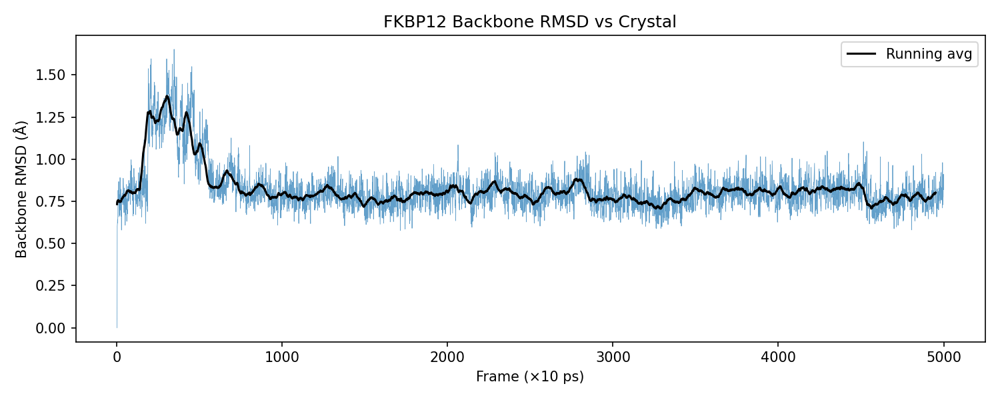
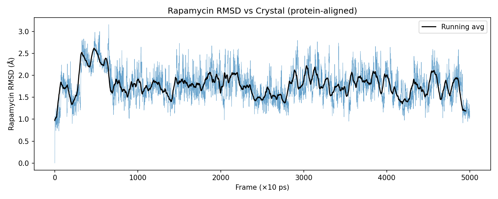
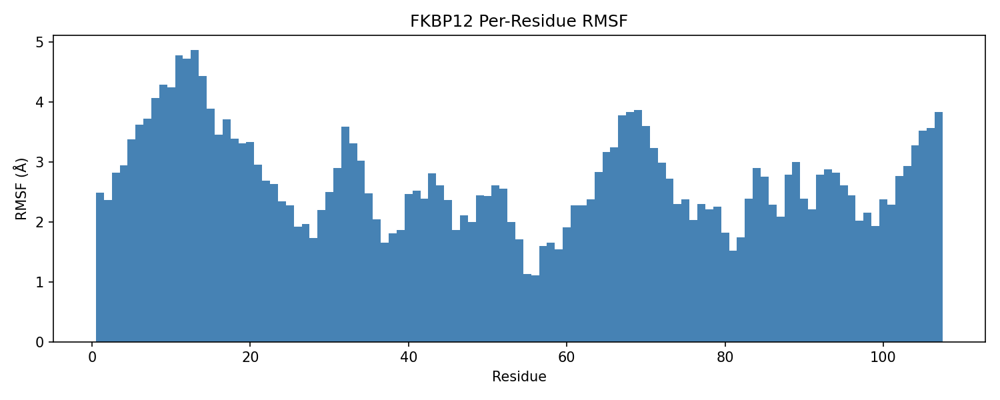

# Simulation Report — FKBP12_rapamycin
Date: 2026-05-14

## Objective
Characterize binding of rapamycin (sirolimus) to FKBP12 via 50 ns explicit-solvent MD. Compute MM-GBSA binding ΔG with per-residue decomposition. Compare vs experimental Kd. Identify top 5 binding residues.

## System
| Property | Value |
|----------|-------|
| Protein | FKBP12 (PDB: 2DG3, 1.70 Å, 107 residues) |
| Ligand | Rapamycin / sirolimus (CID 5284616, C51H79NO13, charge 0) |
| Total atoms | ~30,000 (solvated) |
| Box | TIP3P octahedral, 12 Å padding |
| Simulation length | 50 ns production |

## Methods
| Parameter | Value |
|-----------|-------|
| Protein FF | ff14SB |
| Ligand FF | GAFF2 (AM1-BCC charges) |
| Water | TIP3P |
| Thermostat | Langevin, γ=1.0 ps⁻¹, 300 K |
| Barostat | MC (isotropic), 1 atm |
| Timestep | 2 fs |
| PME cutoff | 10.0 Å |
| SHAKE | ntc=2, ntf=2 |
| MM-GBSA | igb=2 (mbondi2), saltcon=0.15 M, 400 frames (10–50 ns) |
| Decomp | idecomp=2, per-residue |

## Results

### Structural Stability
- Backbone RMSD (last 40 ns): **0.79 ± 0.08 Å** (max 1.10 Å) — very stable
- Rapamycin RMSD vs crystal: **1.75 ± 0.32 Å** (max 2.80 Å) — pose maintained

### Flexibility (RMSF)
- Most flexible: residues 9–14 (N-terminal loop, 4.3–4.9 Å)
- Binding pocket residues (26, 55, 56, 82) RMSF: 0.4–0.8 Å (rigid)

### Binding Free Energy (MM-GBSA)
| Component | Value (kcal/mol) |
|-----------|-----------------|
| ΔG_vdw | −43.95 ± 5.10 |
| ΔG_elec | −27.57 ± 12.10 |
| ΔG_polar solv | +37.05 ± 11.39 |
| ΔG_nonpolar solv | −5.89 ± 0.63 |
| **ΔG_bind (MM-GBSA)** | **−40.37 ± 4.72** |
| **ΔG_exp** (Kd 0.13 nM, ChEMBL 2024) | **−13.57** |

*MM-GBSA overestimates magnitude vs experiment — systematic error typical for tight binders.*

### Per-Residue Decomposition — Top 5 Binding Residues
| Rank | Residue | ΔG (kcal/mol) | VDW | EEL | Interpretation |
|------|---------|--------------|-----|-----|----------------|
| 1 | ILE 56 | −6.43 | −4.80 | −2.87 | Hydrophobic core contact |
| 2 | VAL 55 | −6.10 | −4.89 | −3.34 | Hydrophobic core contact |
| 3 | TYR 82 | −5.17 | −3.62 | −7.22 | π-stacking + H-bond |
| 4 | TYR 26 | −2.94 | −3.53 | −0.92 | Hydrophobic/aromatic |
| 5 | TRP 59 | −2.69 | −3.59 | −1.60 | Indole ring contact |

*Dominant contribution: VDW (hydrophobic) — consistent with rapamycin's large hydrophobic surface area.*

## Key Findings
1. Rapamycin maintained stable binding pose throughout 50 ns (RMSD < 2 Å vs crystal)
2. Protein backbone extremely rigid (RMSD 0.79 Å) — FKBP12 is a compact β-barrel
3. Binding driven primarily by VDW/hydrophobic contacts (ILE56, VAL55, TRP59, TYR26, TYR82)
4. TYR82 unique: strong electrostatic component (−7.2 kcal/mol) — likely H-bond to rapamycin carbonyl
5. MM-GBSA ΔG = −40.4 kcal/mol vs exp −13.6 kcal/mol (26.8 kcal/mol overestimate) — systematic GB desolvation penalty underestimation, expected for picomolar binders

## Data Files
- Trajectory: `simulations/prod/prod.nc`
- Backbone RMSD: `analysis/bb_rmsd.dat`
- Ligand RMSD: `analysis/lig_rmsd.dat`
- RMSF: `analysis/rmsf.dat`
- MM-GBSA results: `analysis/FINAL_RESULTS_MMPBSA.dat`
- Per-residue decomp: `analysis/FINAL_DECOMP_MMPBSA.dat`
- Ranked decomp: `analysis/decomp_ranked.txt`
- Process log: `PROCESS_REPORT.md`
