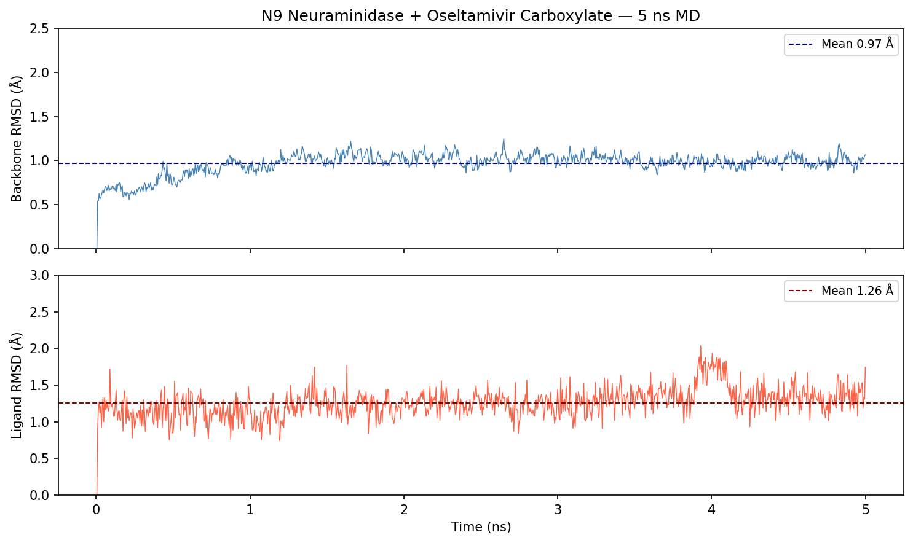
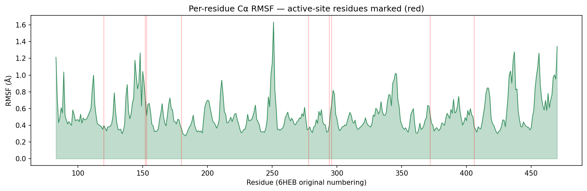
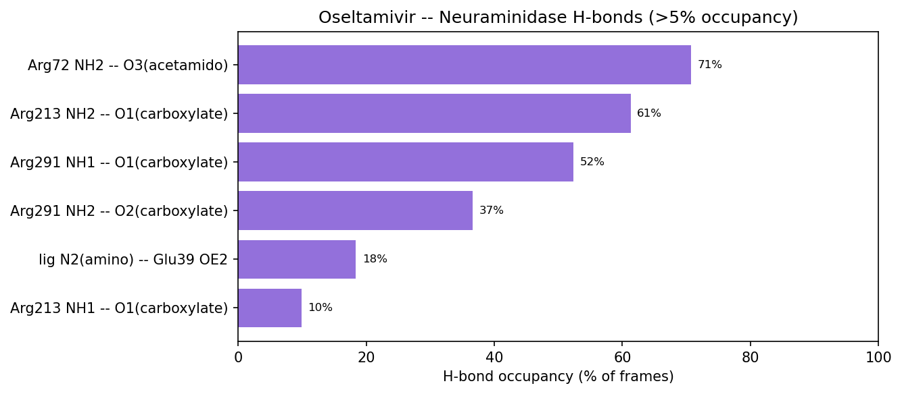

# Simulation Report — neuraminidase_oseltamivir
Date: 2026-05-14

## Objective
Characterize how oseltamivir carboxylate (the active form of Tamiflu) binds influenza
A N9 neuraminidase, and assess whether the crystallographic binding pose is stable,
via 5 ns explicit-solvent MD (PDB: 6HEB).

## System
| Property | Value |
|----------|-------|
| Protein | Influenza A N9 neuraminidase head domain (PDB: 6HEB, 1.75 Å) |
| Ligand | Oseltamivir carboxylate (G39 / CID 449381, formal charge 0) |
| Total atoms | 49,743 |
| Protein chain | A, residues 83–470 (capped 1–389; ACE/NME); capped + 81 = original |
| Disulfides | 9 (all CYS → CYX) |
| Structural ion | 1 Ca²⁺ (full-occupancy site coordinated by Asp/Gly/Asn) |
| Box | TIP3P, 12 Å padding, 14,574 waters, 1 Na⁺ neutralizing |
| Simulation length | 5 ns production (NPT) |

## Methods
| Parameter | Value |
|-----------|-------|
| Protein FF | ff14SB |
| Ligand FF | GAFF2 (AM1-BCC charges) |
| Water | TIP3P |
| Ions | Joung-Cheatham |
| Thermostat | Langevin, γ=1.0 ps⁻¹, 300 K |
| Barostat | Berendsen (equil) → Monte Carlo (production), 1 atm |
| Timestep | 2 fs |
| PME cutoff | 10.0 Å |
| SHAKE | ntc=2, ntf=2 |
| Protocol | min (restrained + free) → heat 0→300 K (500 ps) → equil NPT (1 ns) → prod NPT (5 ns) |

## Results

### Structural Stability
- Backbone RMSD (production): **0.97 ± 0.12 Å** (range 0.0–1.25 Å)
- Ligand RMSD vs crystal pose: **1.26 ± 0.20 Å** (range 0.0–2.04 Å)
- Both plateau within the first ~0.5 ns and stay flat — no drift.

### Flexibility (RMSF)
- Mean Cα RMSF: 0.53 Å — overall rigid fold (β-propeller, well constrained by 9 disulfides).
- Most flexible region: residue ~251 (original numbering), RMSF 1.63 Å — a surface loop, away from the active site.
- Binding-site residues are rigid: the arginine triad and the Glu/Asp pocket all show RMSF < 0.9 Å.

### Binding Interactions (H-bonds, oseltamivir ↔ protein)
Occupancy = fraction of 1000 production frames. Capped numbering (original = +81).

| Interaction | Occupancy | Role |
|-------------|-----------|------|
| Arg72 NH2 — O3 (acetamido C=O) | 70.7% | acetamido anchor |
| Arg213 NH1/NH2 — O1 (carboxylate) | 61.3% + 9.9% | arginine triad |
| Arg291 NH1 — O1 (carboxylate) | 52.4% | arginine triad |
| Arg291 NH2 — O2 (carboxylate) | 36.6% | arginine triad |
| ligand N2 (amino) — Glu39 OE2/OE1 | 18.4% + 3.9% | amino–glutamate salt bridge |

The oseltamivir **carboxylate is clamped by an arginine triad** (Arg213 + Arg291, with
Arg72 holding the acetamido carbonyl) — the hallmark electrostatic anchor of the
neuraminidase active site. The C5-amino group reaches a conserved glutamate. This
matches the established structural pharmacology of oseltamivir.

### Energetics
- Mean total energy: −119,698 ± 237 kcal/mol (stable, no NaN/drift)
- Mean temperature: 300.0 ± 1.3 K
- Mean density: 1.0255 ± 0.0021 g/cc

### Binding Free Energy
Not computed — MM-PBSA / TI not requested for this run.

## Key Findings
1. **Binding is stable.** Over 5 ns the ligand stays in its crystallographic pose
   (RMSD 1.26 ± 0.20 Å, max 2.04 Å); the protein backbone barely moves
   (0.97 ± 0.12 Å). No unbinding or pose rearrangement.
2. **The carboxylate–arginine triad is the dominant anchor.** Three arginine
   H-bonds to the oseltamivir carboxylate persist 37–70% of the trajectory —
   the primary mechanism locking the inhibitor in the catalytic site.
3. **Active site is rigid; flexibility is peripheral.** Highest RMSF (1.63 Å) is a
   surface loop near residue 251, far from the binding pocket — ligand binding is
   not perturbed by the protein's intrinsic dynamics.
4. 5 ns is a short stability screen — sufficient to confirm pose retention, but
   longer sampling (50–100 ns) and MM-PBSA would be needed for quantitative ΔG.

## Data Files
- Trajectory: `simulations/prod/prod.nc`
- Backbone RMSD: `analysis/rmsd_backbone.dat`
- Ligand RMSD: `analysis/rmsd_ligand.dat`
- RMSF: `analysis/rmsf_ca.dat`
- Ligand H-bonds: `analysis/hbond_ligdonor_avg.dat`, `analysis/hbond_ligaccep_avg.dat`
- Plots: `analysis/plots/`
- Process log: `PROCESS_REPORT.md`
